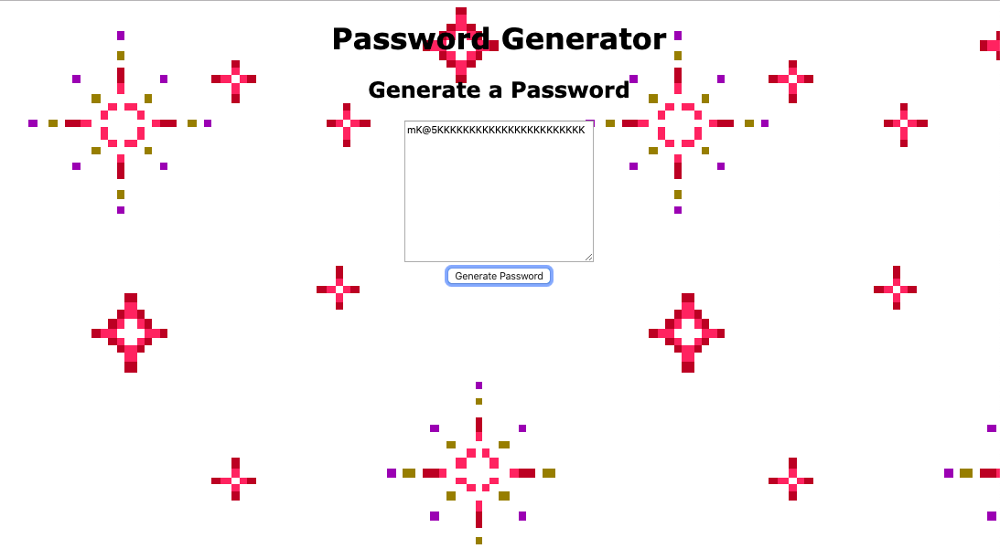

# My Random Password Generator

The purpose of my Random Password Generator application is to generate a random password, upon the user's clicking on a button. 

The nature of the password is determined by a series of prompts the user responds to, which collects information with regards to: how many characters long they want their password to be, and if they wish for lowercase letters, uppercase letters, numbers, or special characters to be included. 

The application keeps track of the user's responses to those questions, and generates a randomized string of characters as a "random password". The characters drawn upon are included in javascript arrays.

### GH Pages URL: https://pmahalan.github.io/password_generator/

